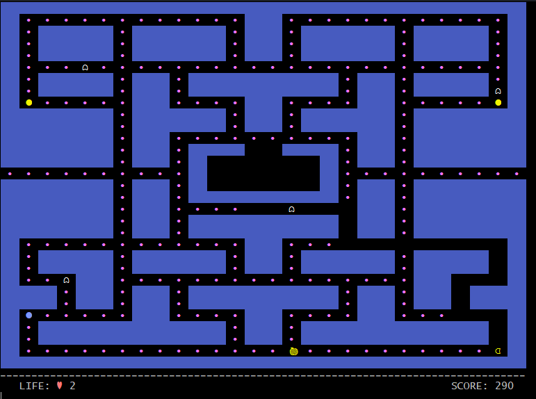
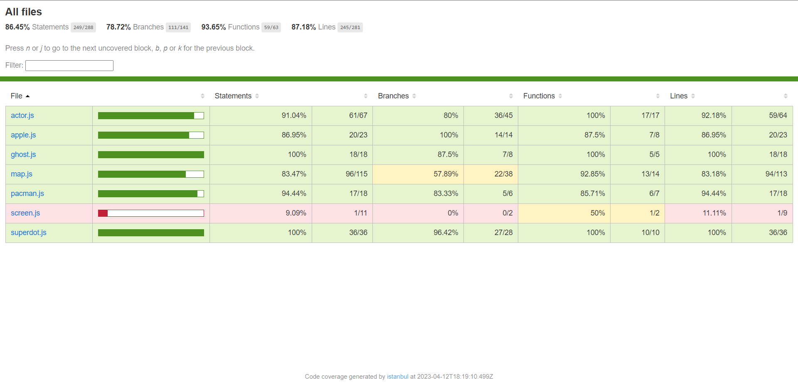

# **Pacman Game with JavaScript**

## **Problem Description**
Pacman finds himself in a grid filled with monsters. Will he be able to eat all the dots on the board before the ghosts eat him?

complete list of things the game needs:

- pacman is on a grid filled with dots
- pacman has a direction
- pacman moves on each tick
- pacman eats dots/super dots/fruits
- ghosts
- game score (levels completed, number of dots eaten in this level)

Demo: https://g.co/kgs/G8eUP1

## **Solution Proposed**

with the implementation of the modules, clases and respective test files, this is the proposal for the problem:

### Execution of the code

### Execution of unit tests

